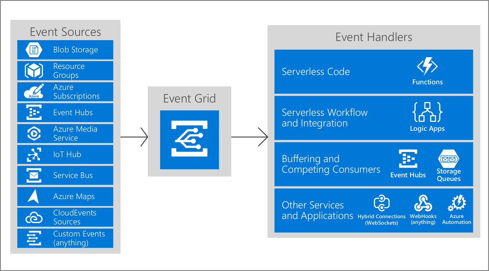
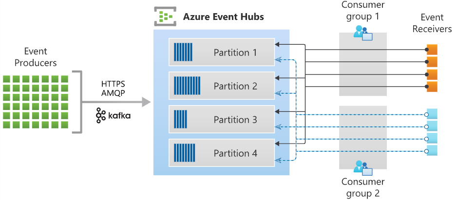

# AZ-204/AZ-204 Develop event-based solutions

[Learn Link](https://learn.microsoft.com/en-us/training/paths/az-204-develop-event-based-solutions/){:target="_blank"}


Azure Event Grid is deeply integrated with Azure services and can be integrated with third-party services. It simplifies event consumption and lowers costs by eliminating the need for constant polling. Event Grid efficiently and reliably routes events from Azure and non-Azure resources, and distributes the events to registered subscriber endpoints.



Events
: What happended. Smallest amount of info that fully describes something that happended. Common info: source, time, unique Id. 64 KB covered by GA SLA. 1 MB support is in preview. Events over 64 KB are charged in 64 KB increments.

Event Sources
: Where the event happens. Related to one or more event types. e.g. Azure Storage is the source for blob created events. IoT Hub is the source for device created events. You app is the source for custom events.

Topics
: Event Grid topic provides an endpoint where the source sends events. Publisher creates the topic and decides if the source needs one or more than one topic. Subscribers decide which topics to subscribe to.

Event Subscriptions
: Tells Event Grid which events on a topic to receive. When creating a subscription you provide an endpoint for handing the event. Events can be filtered by topic or subject pattern. Expiration can be set for events needed for a limited time and you don't want to have to clean them up.

Event handlers
: Where the event is sent. Takes some action to process the event. Several handler types are supported. Can be a supported Azure service or your own webhook. Different types of handlers have different mechanisms for Event Grid to ensure delivery. e.g. HTTP webhook events are retried until a 200 OK is received. Azure Storage Queue - events are retried until the service pushes the message into the queue.

#### Event schemas
Two types: 
* Event Grid schema
* Cloud event schema

Events are sent in an array which can have several event objects. Total size is 1 MB with each event also limited to 1 MB. Going over either results in ```413 Payload Too Large```. Charged in 64 KB increments.

Azure publisher's data payload can be found in the [Event Schema Store](https://github.com/Azure/azure-rest-api-specs/tree/master/specification/eventgrid/data-plane){:target= "_blank"}

**Event Schema**
```
[
  {
    "topic": string, // not required, if not included Event Grid adds. Full path to event source.
    "subject": string, // required, publisher-defined path
    "id": string, // required
    "eventType": string, // requried - one of the registered event types for the source
    "eventTime": string, // required - UTC time
    "data":{
      object-unique-to-each-publisher // not required
    },
    "dataVersion": string, // not required - specific to resource provider
    "metadataVersion": string // not reqiored - defined by publisha
  }
]
```
For custom topics, the event publisher determines the data object. The top-level data should have the same fields as standard resource-defined events.

When publishing events to custom topics, create subjects for your events that make it easy for subscribers to know whether they're interested in the event. Subscribers use the subject to filter and route events. Consider providing the path for where the event happened, so subscribers can filter by segments of that path. The path enables subscribers to narrowly or broadly filter events. For example, if you provide a three segment path like /A/B/C in the subject, subscribers can filter by the first segment /A to get a broad set of events. Those subscribers get events with subjects like /A/B/C or /A/D/E. Other subscribers can filter by /A/B to get a narrower set of events.

Sometimes your subject needs more detail about what happened. For example, the Storage Accounts publisher provides the subject /blobServices/default/containers/<container-name>/blobs/<file> when a file is added to a container. A subscriber could filter by the path /blobServices/default/containers/testcontainer to get all events for that container but not other containers in the storage account. A subscriber could also filter or route by the suffix .txt to only work with text files.

**Cloud Event Schema**
In addition to its default event schema, Azure Event Grid natively supports events in the JSON implementation of CloudEvents v1.0 and HTTP protocol binding. CloudEvents is an open specification for describing event data.

Example of Azure Blob Storage in CloudEvents format:
```
{
    "specversion": "1.0",
    "type": "Microsoft.Storage.BlobCreated",  
    "source": "/subscriptions/{subscription-id}/resourceGroups/{resource-group}/providers/Microsoft.Storage/storageAccounts/{storage-account}",
    "id": "9aeb0fdf-c01e-0131-0922-9eb54906e209",
    "time": "2019-11-18T15:13:39.4589254Z",
    "subject": "blobServices/default/containers/{storage-container}/blobs/{new-file}",
    "dataschema": "#",
    "data": {
        "api": "PutBlockList",
        "clientRequestId": "4c5dd7fb-2c48-4a27-bb30-5361b5de920a",
        "requestId": "9aeb0fdf-c01e-0131-0922-9eb549000000",
        "eTag": "0x8D76C39E4407333",
        "contentType": "image/png",
        "contentLength": 30699,
        "blobType": "BlockBlob",
        "url": "https://gridtesting.blob.core.windows.net/testcontainer/{new-file}",
        "sequencer": "000000000000000000000000000099240000000000c41c18",
        "storageDiagnostics": {
            "batchId": "681fe319-3006-00a8-0022-9e7cde000000"
        }
    }
}
```
A detailed description of the available fields, their types, and definitions in CloudEvents v1.0 is [available here](https://github.com/cloudevents/spec/blob/v1.0/spec.md#required-attributes){:target="_blankL}.

For CloudEvents schema, header value is ```"content-type":"application/cloudevents+json; charset=utf-8"```. 
For Event Grid schema,  header value is ```"content-type":"application/json; charset=utf-8"```.

#### Event Eelivery Durability

Event Grid doesn't guarantee order for event delivery, so subscribers may receive them out of order.

Retries do not happen for the following (dropped or delivered to Dead-Letter):
|Endpoint Type|Error codes|
|---|---|
|Azure Resources|	400 Bad Request, 413 Request Entity Too Large, 403 Forbidden|
|Webhook	|400 Bad Request, 413 Request Entity Too Large, 403 Forbidden, 404 Not Found, 401 Unauthorized|

If the error returned by the subscribed endpoint isn't among the above list, Event Grid waits 30 seconds for a response after delivering a message. After 30 seconds, if the endpoint hasn’t responded, the message is queued for retry. Event Grid uses an exponential backoff retry policy for event delivery.
If the endpoint responds within 3 minutes, Event Grid attempts to remove the event from the retry queue on a best effort basis but duplicates may still be received.

Retry Policy can be customezed with the following:
* **Maxium number of attempts** - default 30 (integer between 1 and 30 allowed).
* **Event time-to-live (TTL)** - default is 1440 minutes (integer between 1 and 1440)
Bash Azure CLI example
```
az eventgrid event-subscription create \
  -g gridResourceGroup \
  --topic-name <topic_name> \
  --name <event_subscription_name> \
  --endpoint <endpoint_URL> \
  --max-delivery-attempts 18
  ```
**Output Batchine**
Off by default, can be turned on per subscription
* **Max events per batch** - Max number, may be fewer (doesn't wait for max before delivery). Integer between 1 and 5,000.
* **Preferred batch size in KB** - Tagget ceiling for batch size in KBs. May be smaller (does not wait for max). Could be lager *if* a single event is larger than preference.

**Delayed Delivery**
As an endpoint experiences delivery failures, Event Grid begins to delay the delivery and retry of events to that endpoint. For example, if the first 10 events published to an endpoint fail, Event Grid assumes that the endpoint is experiencing issues and will delay all subsequent retries, and new deliveries, for some time - in some cases up to several hours.

**Dead-letter events**
* TTL is exceeded
* Number of tries is exceeded
Not turned on by default. Must specify a storage account to hold undelivered event when creating a subscription. Pull events from this storage account to resolve deliveries.

There's a five-minute delay between the last attempt to deliver an event and when it's delivered to the dead-letter location. This delay is intended to reduce the number of Blob storage operations. If the dead-letter location is unavailable for four hours, the event is dropped.

**Custom Delivery Properties**
Event subscriptions allow you to set up HTTP headers that are included in delivered events. This capability allows you to set custom headers that are required by a destination. You can set up to 10 headers when creating an event subscription. Each header value shouldn't be greater than 4,096 bytes. You can set custom headers on the events that are delivered to the following destinations:
* Webhooks
* Azure Service Bus topics and queues
* Azure Event Hubs
* Relay Hybrid Connections

#### Control access to events
Azure Event Grid allows you to control the level of access given to different users to do various management operations such as list event subscriptions, create new ones, and generate keys. Event Grid uses Azure role-based access control (Azure RBAC).

**Build-in Roles**
|Role | Description|
|--- | ---|
|Event Grid Subscription Reader	| Lets you read Event Grid event subscriptions.|
|Event Grid Subscription Contributor	| Lets you manage Event Grid event subscription operations.|
|Event Grid Contributor	| Lets you create and manage Event Grid resources.|
|Event Grid Data Sender |	Lets you send events to Event Grid topics.|

**Permissions for event subscriptions**
If you're using an event handler that isn't a WebHook (such as an event hub or queue storage), you need write access to that resource. This permissions check prevents an unauthorized user from sending events to your resource.

You must have the **Microsoft.EventGrid/EventSubscriptions/Write** permission on the resource that is the event source. You need this permission because you're writing a new subscription at the scope of the resource. The required resource differs based on whether you're subscribing to a system topic or custom topic. Both types are described in this section.

#### Receive events using webhooks
Like many other services that support webhooks, Event Grid requires you to prove ownership of your Webhook endpoint before it starts delivering events to that endpoint. This requirement prevents a malicious user from flooding your endpoint with events.

When you use any of the following three Azure services, the Azure infrastructure automatically handles this validation:

* Azure Logic Apps with Event Grid Connector
* Azure Automation via webhook
* Azure Functions with Event Grid Trigger

If you're using any other type of endpoint, such as an HTTP trigger based Azure function, your endpoint code needs to participate in a validation handshake with Event Grid. Event Grid supports two ways of validating the subscription.

* **Synchronous handshake**: At the time of event subscription creation, Event Grid sends a subscription validation event to your endpoint. The schema of this event is similar to any other Event Grid event. The data portion of this event includes a validationCode property. Your application verifies that the validation request is for an expected event subscription, and returns the validation code in the response synchronously. This handshake mechanism is supported in all Event Grid versions.

* **Asynchronous handshake**: In certain cases, you can't return the ValidationCode in response synchronously. For example, if you use a third-party service (like Zapier or IFTTT), you can't programmatically respond with the validation code.

Starting with version 2018-05-01-preview, Event Grid supports a manual validation handshake. If you're creating an event subscription with an SDK or tool that uses API version 2018-05-01-preview or later, Event Grid sends a ```validationUrl``` property in the data portion of the subscription validation event. To complete the handshake, find that URL in the event data and do a GET request to it. You can use either a REST client or your web browser.

The provided URL is valid for 5 minutes. During that time, the provisioning state of the event subscription is ```AwaitingManualAction```. If you don't complete the manual validation within 5 minutes, the provisioning state is set to ```Failed```. You have to create the event subscription again before starting the manual validation.

This authentication mechanism also requires the webhook endpoint to return an HTTP status code of 200 so that it knows that the POST for the validation event was accepted before it can be put in the manual validation mode. In other words, if the endpoint returns 200 but doesn't return back a validation response synchronously, the mode is transitioned to the manual validation mode. If there's a GET on the validation URL within 5 minutes, the validation handshake is considered to be successful.

Using self-signed certificates for validation isn't supported. Use a signed certificate from a commercial certificate authority (CA) instead.

#### Filter events
When creating an event subscription, you have three options for filtering:
* Event types
* Subject begins with or ends with
* Advanced fields and operators

JSON syntax for filtering by event type:
```
"filter": {
  "includedEventTypes": [
    "Microsoft.Resources.ResourceWriteFailure",
    "Microsoft.Resources.ResourceWriteSuccess"
  ]
}
```
JSON syntax for Subject filtering:
```
"filter": {
  "subjectBeginsWith": "/blobServices/default/containers/mycontainer/log",
  "subjectEndsWith": ".jpg"
}
```

To filter by values in the data fields and specify the comparison operator, use the advanced filtering option. In advanced filtering, you specify the:
* operator type - The type of comparison.
* key - The field in the event data that you're using for filtering. It can be a number, boolean, or string.
* value or values - The value or values to compare to the key.

JSON syntax for Advanced filtering:
```
"filter": {
  "advancedFilters": [
    {
      "operatorType": "NumberGreaterThanOrEquals",
      "key": "Data.Key1",
      "value": 5
    },
    {
      "operatorType": "StringContains",
      "key": "Subject",
      "values": ["container1", "container2"]
    }
  ]
}
```

### Azure Event Hubs
Azure Event Hubs is a big data streaming platform and event ingestion service. It can receive and process millions of events per second. Data sent to an event hub can be transformed and stored by using any real-time analytics provider or batching/storage adapters.

Azure Event Hubs is the "front door" for an event pipeline, often called *event ingestor*. It sites between publishers and consumers to decouple the stream. 

|Feature	|Description|
|---|---|
|Fully managed PaaS	|Event Hubs is a fully managed Platform-as-a-Service (PaaS) with little configuration or management overhead, so you focus on your business solutions. Event Hubs for Apache Kafka ecosystems give you the PaaS Kafka experience without having to manage, configure, or run your clusters.|
|Real-time and batch processing	|Event Hubs uses a partitioned consumer model, enabling multiple applications to process the stream concurrently and letting you control the speed of processing.|
|Capture event data	|Capture your data in near-real time in Azure Blob storage or Azure Data Lake Storage for long-term retention or micro-batch processing.|
|Scalable	| Scaling options, like Auto-inflate, scale the number of throughput units to meet your usage needs.|
|Rich ecosystem	| Event Hubs for Apache Kafka ecosystems enables Apache Kafka (1.0 and later) clients and applications to talk to Event Hubs. You don't need to set up, configure, and manage your own Kafka clusters.|

**Key concepts**
* An Event Hubs client is the primary interface for developers interacting with the Event Hubs client library. There are several different Event Hubs clients, each dedicated to a specific use of Event Hubs, such as publishing or consuming events.
  * An Event Hubs producer is a type of client that serves as a source of telemetry data, diagnostics information, usage logs, or other log data, as part of an embedded device solution, a mobile device application, a game title running on a console or other device, some client or server based business solution, or a web site.
  * An Event Hubs consumer is a type of client that reads information from the Event Hubs and allows processing of it. Processing may involve aggregation, complex computation and filtering. Processing may also involve distribution or storage of the information in a raw or transformed fashion. Event Hubs consumers are often robust and high-scale platform infrastructure parts with built-in analytics capabilities, like Azure Stream Analytics, Apache Spark.
* A partition is an ordered sequence of events that is held in an Event Hubs. Partitions are a means of data organization associated with the parallelism required by event consumers. Azure Event Hubs provides message streaming through a partitioned consumer pattern in which each consumer only reads a specific subset, or partition, of the message stream. As newer events arrive, they're added to the end of this sequence. The number of partitions is specified at the time an Event Hubs is created and can't be changed.
* A consumer group is a view of an entire Event Hubs. Consumer groups enable multiple consuming applications to each have a separate view of the event stream, and to read the stream independently at their own pace and from their own position. There can be at most five concurrent readers on a partition per consumer group; however it's recommended that there's only one active consumer for a given partition and consumer group pairing. Each active reader receives all of the events from its partition; if there are multiple readers on the same partition, then they'll receive duplicate events.
* Event receivers: Any entity that reads event data from an Event Hubs. All Event Hubs consumers connect via the AMQP 1.0 session. The Event Hubs service delivers events through a session as they become available. All Kafka consumers connect via the Kafka protocol 1.0 and later.
* Throughput units or processing units: Prepurchased units of capacity that control the throughput capacity of Event Hubs.



#### Event Hubs Capture

Azure Event Hubs enables you to automatically capture the streaming data in Event Hubs in an Azure Blob storage or Azure Data Lake Storage account of your choice, with the added flexibility of specifying a time or size interval. Setting up Capture is fast, there are no administrative costs to run it, and it scales automatically with Event Hubs throughput units in the standard tier or processing units in the premium tier.

**How Event Hubs Capture works**
Event Hubs is a time-retention durable buffer for telemetry ingress, similar to a distributed log. The key to scaling in Event Hubs is the partitioned consumer model. Each partition is an independent segment of data and is consumed independently. Over time this data ages off, based on the configurable retention period. As a result, a given event hub never gets "too full."

Event Hubs Capture enables you to specify your own Azure Blob storage account and container, or Azure Data Lake Store account, which are used to store the captured data. These accounts can be in the same region as your event hub or in another region, adding to the flexibility of the Event Hubs Capture feature.

Captured data is written in Apache Avro format: a compact, fast, binary format that provides rich data structures with inline schema. This format is widely used in the Hadoop ecosystem, Stream Analytics, and Azure Data Factory. More information about working with Avro is available later in this article.

**Capture windowing**
Event Hubs Capture enables you to set up a window to control capturing. This window is a minimum size and time configuration with a "first wins policy," meaning that the first trigger encountered causes a capture operation. Each partition captures independently and writes a completed block blob at the time of capture, named for the time at which the capture interval was encountered. The storage naming convention is as follows:


```
{Namespace}/{EventHub}/{PartitionId}/{Year}/{Month}/{Day}/{Hour}/{Minute}/{Second}
```
Note the date values are padded with zeroes; an example filename might be:
```https://mystorageaccount.blob.core.windows.net/mycontainer/mynamespace/myeventhub/0/2017/12/08/03/03/17.avro```

**Scaling to throughput units**
Event Hubs traffic is controlled by throughput units. A single throughput unit allows 1 MB per second or 1000 events per second of ingress and twice that amount of egress. Standard Event Hubs can be configured with 1-20 throughput units, and you can purchase more with a quota increase support request. Usage beyond your purchased throughput units is throttled. Event Hubs Capture copies data directly from the internal Event Hubs storage, bypassing throughput unit egress quotas and saving your egress for other processing readers, such as Stream Analytics or Spark.

Once configured, Event Hubs Capture runs automatically when you send your first event, and continues running. To make it easier for your downstream processing to know that the process is working, Event Hubs writes empty files when there's no data. This process provides a predictable cadence and marker that can feed your batch processors.

**Scale Processing Application**
To scale your event processing application, you can run multiple instances of the application and have it balance the load among themselves. In the older versions, EventProcessorHost allowed you to balance the load between multiple instances of your program and checkpoint events when receiving. In the newer versions (5.0 onwards), EventProcessorClient (.NET and Java), or EventHubConsumerClient (Python and JavaScript) allows you to do the same.

When designing the consumer in a distributed environment, the scenario must handle the following requirements:

* **Scale**: Create multiple consumers, with each consumer taking ownership of reading from a few Event Hubs partitions.
* **Load balance**: Increase or reduce the consumers dynamically. For example, when a new sensor type (for example, a carbon monoxide detector) is added to each home, the number of events increases. In that case, the operator (a human) increases the number of consumer instances. Then, the pool of consumers can rebalance the number of partitions they own, to share the load with the newly added consumers.
* **Seamless resume on failures**: If a consumer (consumer A) fails (for example, the virtual machine hosting the consumer suddenly crashes), then other consumers can pick up the partitions owned by consumer A and continue. Also, the continuation point, called a checkpoint or offset, should be at the exact point at which consumer A failed, or slightly before that.
* **Consume events**: While the previous three points deal with the management of the consumer, there must be code to consume the events and do something useful with it. For example, aggregate it and upload it to blob storage.

**Event processor or consumer client**
You don't need to build your own solution to meet these requirements. The Azure Event Hubs SDKs provide this functionality. In .NET or Java SDKs, you use an event processor client (EventProcessorClient), and in Python and JavaScript SDKs, you use EventHubConsumerClient.

For most production scenarios, we recommend that you use the event processor client for reading and processing events. Event processor clients can work cooperatively within the context of a consumer group for a given event hub. Clients will automatically manage distribution and balancing of work as instances become available or unavailable for the group.

**Receive messages**
When you create an event processor, you specify the functions that process events and errors. Each call to the function that processes events delivers a single event from a specific partition. It's your responsibility to handle this event. If you want to make sure the consumer processes every message at least once, you need to write your own code with retry logic. But be cautious about poisoned messages.

We recommend that you do things relatively fast. That is, do as little processing as possible. If you need to write to storage and do some routing, it's better to use two consumer groups and have two event processors.

**Checkpointing**
*Checkpointing* is a process by which an event processor marks or commits the position of the last successfully processed event within a partition. Marking a checkpoint is typically done within the function that processes the events and occurs on a per-partition basis within a consumer group.

If an event processor disconnects from a partition, another instance can resume processing the partition at the checkpoint that was previously committed by the last processor of that partition in that consumer group. When the processor connects, it passes the offset to the event hub to specify the location at which to start reading. In this way, you can use checkpointing to both mark events as "complete" by downstream applications and to provide resiliency when an event processor goes down. It's possible to return to older data by specifying a lower offset from this checkpointing process.

**Thread safety and processor instances**
By default, the function that processes the events is called sequentially for a given partition. Subsequent events and calls to this function from the same partition queue up behind the scenes as the event pump continues to run in the background on other threads. Events from different partitions can be processed concurrently and any shared state that is accessed across partitions have to be synchronized.

#### Event Access Control

Azure Event Hubs supports both Microsoft Entra ID and shared access signatures (SAS) to handle both authentication and authorization. Azure provides the following Azure built-in roles for authorizing access to Event Hubs data using Microsoft Entra ID and OAuth:

* Azure Event Hubs Data Owner: Use this role to give complete access to Event Hubs resources.
* Azure Event Hubs Data Sender: Use this role to give send access to Event Hubs resources.
* Azure Event Hubs Data Receiver: Use this role to give receiving access to Event Hubs resources.

**Authorize access with managed identities**
To authorize a request to Event Hubs service from a managed identity in your application, you need to configure Azure role-based access control settings for that managed identity. Azure Event Hubs defines Azure roles that encompass permissions for sending and reading from Event Hubs. When the Azure role is assigned to a managed identity, the managed identity is granted access to Event Hubs data at the appropriate scope.

**Authorize access with Microsoft identity platform**
A key advantage of using Microsoft Entra ID with Event Hubs is that your credentials no longer need to be stored in your code. Instead, you can request an OAuth 2.0 access token from Microsoft identity platform. Microsoft Entra authenticates the security principal (a user, a group, or service principal) running the application. If authentication succeeds, Microsoft Entra ID returns the access token to the application, and the application can then use the access token to authorize requests to Azure Event Hubs.

**Authorize access to Event Hubs publishers with shared access signatures**
An event publisher defines a virtual endpoint for an Event Hubs. The publisher can only be used to send messages to an event hub and not receive messages. Typically, an event hub employs one publisher per client. All messages that are sent to any of the publishers of an event hub are enqueued within that event hub. Publishers enable fine-grained access control.

Each Event Hubs client is assigned a unique token that is uploaded to the client. A client that holds a token can only send to one publisher, and no other publisher. If multiple clients share the same token, then each of them shares the publisher.

All tokens are assigned with shared access signature keys. Typically, all tokens are signed with the same key. Clients aren't aware of the key, which prevents clients from manufacturing tokens. Clients operate on the same tokens until they expire.

**Authorize access to Event Hubs consumers with shared access signatures**
To authenticate back-end applications that consume from the data generated by Event Hubs producers, Event Hubs token authentication requires its clients to either have the manage rights or the listen privileges assigned to its Event Hubs namespace or event hub instance or topic. Data is consumed from Event Hubs using consumer groups. While SAS policy gives you granular scope, this scope is defined only at the entity level and not at the consumer level. It means that the privileges defined at the namespace level or the event hub instance or topic level are to the consumer groups of that entity.

**Inspect Event Hubs**
The following code uses the EventHubProducerClient to connect and get the partition ids.
```
var connectionString = "<< CONNECTION STRING FOR THE EVENT HUBS NAMESPACE >>";
var eventHubName = "<< NAME OF THE EVENT HUB >>";

await using (var producer = new EventHubProducerClient(connectionString, eventHubName))
{
    string[] partitionIds = await producer.GetPartitionIdsAsync();
}
```

**Publish events to Event Hubs**

The following code uses an EventHubProducerClient to send events. Producers may request a specific partition or allow the service to determine the partition. Recommendation is to use automatic routing. 
```
var connectionString = "<< CONNECTION STRING FOR THE EVENT HUBS NAMESPACE >>";
var eventHubName = "<< NAME OF THE EVENT HUB >>";

await using (var producer = new EventHubProducerClient(connectionString, eventHubName))
{
    using EventDataBatch eventBatch = await producer.CreateBatchAsync();
    eventBatch.TryAdd(new EventData(new BinaryData("First")));
    eventBatch.TryAdd(new EventData(new BinaryData("Second")));

    await producer.SendAsync(eventBatch);
}
```

**Read events from an Event Hub**

The following example uses an EventHubConsumerClient for a given consumer group to read events (default group is created automatically).
For production scenarios it is recommended to use the [Event Processor Client](https://github.com/Azure/azure-sdk-for-net/blob/main/sdk/eventhub/Azure.Messaging.EventHubs.Processor){:target="_blank"} as it is more robust and performant.

```
var connectionString = "<< CONNECTION STRING FOR THE EVENT HUBS NAMESPACE >>";
var eventHubName = "<< NAME OF THE EVENT HUB >>";

string consumerGroup = EventHubConsumerClient.DefaultConsumerGroupName;

await using (var consumer = new EventHubConsumerClient(consumerGroup, connectionString, eventHubName))
{
    using var cancellationSource = new CancellationTokenSource();
    cancellationSource.CancelAfter(TimeSpan.FromSeconds(45));

    await foreach (PartitionEvent receivedEvent in consumer.ReadEventsAsync(cancellationSource.Token))
    {
        // At this point, the loop will wait for events to be available in the Event Hub.  When an event
        // is available, the loop will iterate with the event that was received.  Because we did not
        // specify a maximum wait time, the loop will wait forever unless cancellation is requested using
        // the cancellation token.
    }
}
```
This example reads from a partition:
```
var connectionString = "<< CONNECTION STRING FOR THE EVENT HUBS NAMESPACE >>";
var eventHubName = "<< NAME OF THE EVENT HUB >>";

string consumerGroup = EventHubConsumerClient.DefaultConsumerGroupName;

await using (var consumer = new EventHubConsumerClient(consumerGroup, connectionString, eventHubName))
{
    EventPosition startingPosition = EventPosition.Earliest;
    string partitionId = (await consumer.GetPartitionIdsAsync()).First();

    using var cancellationSource = new CancellationTokenSource();
    cancellationSource.CancelAfter(TimeSpan.FromSeconds(45));

    await foreach (PartitionEvent receivedEvent in consumer.ReadEventsFromPartitionAsync(partitionId, startingPosition, cancellationSource.Token))
    {
        // At this point, the loop will wait for events to be available in the partition.  When an event
        // is available, the loop will iterate with the event that was received.  Because we did not
        // specify a maximum wait time, the loop will wait forever unless cancellation is requested using
        // the cancellation token.
    }
}
```
The follwoing uses the EventProcessorClient (recommended). Since the EventProcessorClient has a dependency on Azure Storage blobs for persistence of its state, you need to provide a BlobContainerClient for the processor, which has been configured for the storage account and container that should be used.

```
var cancellationSource = new CancellationTokenSource();
cancellationSource.CancelAfter(TimeSpan.FromSeconds(45));

var storageConnectionString = "<< CONNECTION STRING FOR THE STORAGE ACCOUNT >>";
var blobContainerName = "<< NAME OF THE BLOB CONTAINER >>";

var eventHubsConnectionString = "<< CONNECTION STRING FOR THE EVENT HUBS NAMESPACE >>";
var eventHubName = "<< NAME OF THE EVENT HUB >>";
var consumerGroup = "<< NAME OF THE EVENT HUB CONSUMER GROUP >>";

Task processEventHandler(ProcessEventArgs eventArgs) => Task.CompletedTask;
Task processErrorHandler(ProcessErrorEventArgs eventArgs) => Task.CompletedTask;

var storageClient = new BlobContainerClient(storageConnectionString, blobContainerName);
var processor = new EventProcessorClient(storageClient, consumerGroup, eventHubsConnectionString, eventHubName);

processor.ProcessEventAsync += processEventHandler;
processor.ProcessErrorAsync += processErrorHandler;

await processor.StartProcessingAsync();

try
{
    // The processor performs its work in the background; block until cancellation
    // to allow processing to take place.

    await Task.Delay(Timeout.Infinite, cancellationSource.Token);
}
catch (TaskCanceledException)
{
    // This is expected when the delay is canceled.
}

try
{
    await processor.StopProcessingAsync();
}
finally
{
    // To prevent leaks, the handlers should be removed when processing is complete.

    processor.ProcessEventAsync -= processEventHandler;
    processor.ProcessErrorAsync -= processErrorHandler;
}
```
