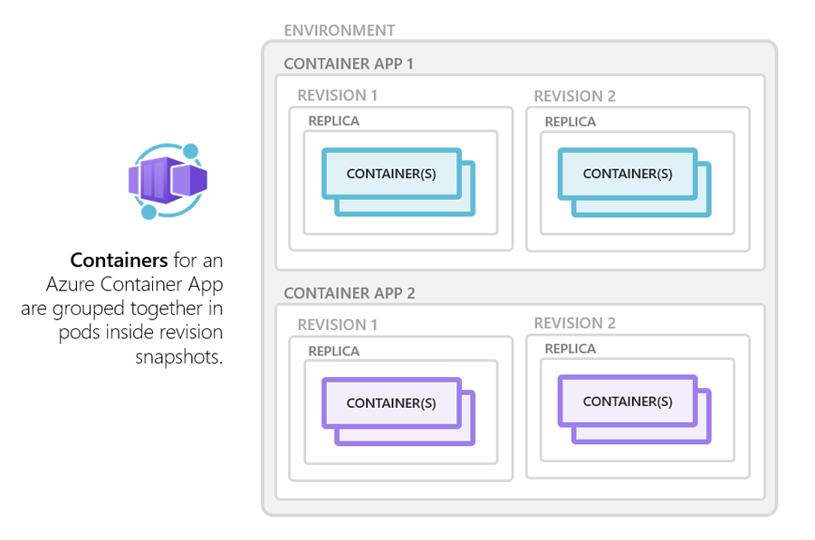
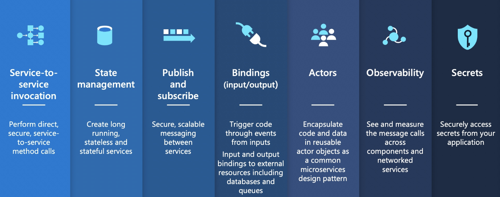

# Implement containerized solutions


### Discover the Azure Container Registry

**ACR Tiers**

|Tier|Description|
|--|--|
|Basic|	A cost-optimized entry point for developers learning about Azure Container Registry. Basic registries have the same programmatic capabilities as Standard and Premium (such as Microsoft Entra authentication integration, image deletion, and webhooks). However, the included storage and image throughput are most appropriate for lower usage scenarios.?
|Standard?	Standard registries offer the same capabilities as Basic, with increased included storage and image throughput. Standard registries should satisfy the needs of most production scenarios.?
|Premium|	Premium registries provide the highest amount of included storage and concurrent operations, enabling high-volume scenarios. In addition to higher image throughput, Premium adds features such as geo-replication for managing a single registry across multiple regions, content trust for image tag signing, and private link with private endpoints to restrict access to the registry.|

Use Azure Container Registry Tasks (ACR Tasks) to streamline building, testing, pushing, and deploying images in Azure. Configure build tasks to automate your container OS and framework patching pipeline, and build images automatically when your team commits code to source control.

**Explore storage capabilities**

* All container images are envcrypted at rest.
* Data is stored in the region where the registry is created. Geo-replication is available in the premium tier.
* Premium tire also uses Availability Zones to replicate your registry to a minimum of three zones in each enabled region.
* Store limit in TB appears to be 20 TB in all tiers.

**Build and manage containers with tasks**

Task scenarios
* Quick Task - ```az acr build``` (comparable to ```docker build```) takes a context, sends it to ACR Tasks and by default, pushes the built image to its registry upon completion.
* Triggers 
  * Trigger task on source code update - configure a build task with the Azure CLI command ```az acr task`` create by specifying a Git repository and optionally a branch and Dockerfile.
  * Trigger on base image update - You can set up an ACR task to track a dependency on a base image when it builds an application image.
  * Schedule a task - Schedule a task by setting up one or more timer triggers when you create or update the task
* Multi-step tasks -  defined in a YAML file specify individual build and push operations for container images or other artifacts. They can also define the execution of one or more containers, with each step using the container as its execution environment. For example, you can create a multi-step task that automates the following:
  * Build a web application image
  * Run the web application container
  * Build a web application test image
  * Run the web application test container, which performs tests against the running application container
  * If the tests pass, build a Helm chart archive package
  * Perform a helm upgrade using the new Helm chart archive package

By default, ACR Tasks builds images for the Linux OS and the amd64 architecture. Specify the --platform tag to build Windows images or Linux images for other architectures. Specify the OS and optionally a supported architecture in OS/architecture format (for example, --platform Linux/arm). For ARM architectures, optionally specify a variant in OS/architecture/variant format (for example, --platform Linux/arm64/v8):

|OS|	Architecture|
|--|--|
|Linux|	amd64 arm arm64 386|
|Windows|	amd64|


**Explore elements of a Dockerfile**

A Dockerfile is a script that contains a series of instructions that are used to build a Docker image. Dockerfiles typically include the following information:
* The base or parent image we use to create the new image
* Commands to update the base OS and install other software
* Build artifacts to include, such as a developed application
* Services to expose, such a storage and network configuration
* Command to run when the container is launched

**Explore Azure Container Instances**

Azure Container Instances (ACI) is a great solution for any scenario that can operate in isolated containers, including simple applications, task automation, and build jobs. Here are some of the benefits:
* Fast startup: ACI can start containers in Azure in seconds, without the need to provision and manage VMs
* Container access: ACI enables exposing your container groups directly to the internet with an IP address and a fully qualified domain name (FQDN)
* Hypervisor-level security: Isolate your application as completely as it would be in a VM
* Customer data: The ACI service stores the minimum customer data required to ensure your container groups are running as expected
* Custom sizes: ACI provides optimum utilization by allowing exact specifications of CPU cores and memory
* Persistent storage: Mount Azure Files shares directly to a container to retrieve and persist state
* Linux and Windows: Schedule both Windows and Linux containers using the same API.

Container groups
: Top-level resource in ACI is the *container group*. A collection of containers scheduled on the same host. Sharing a lifecycle, resource, local network and storage volumes. They are assigned a DNS name label (all containers under the same label).

***Multi-container groups currently support only Linux containers. For Windows containers, Azure Container Instances only supports deployment of a single instance.***

Deployment
: Use a Resource Manager template or a YAML file. YAML is recommended when your deployment includes only container instances, RM when you need to deploy more service (such as file share).

Networking 
: Container groups shared an IP address. Since the containers in the group share an port namespace, port mapping isn't supported. Within the group containers reach each other via localhost on the container's exposed port. 

Storage
: Supported volumes include
  * Azure file share
  * Secret
  * Empty directory
  * Cloned git repository

**Container restart policy**
|Restart policy|	Description|
|--|--|
|Always|	Containers in the container group are always restarted. This is the default setting applied when no restart policy is specified at container creation.|
|Never|	Containers in the container group are never restarted. The containers run at most once.|
|OnFailure|	Containers in the container group are restarted only when the process executed in the container fails (when it terminates with a nonzero exit code). The containers are run at least once.|

Specify the ```--restart-policy``` param when calling ```az container create```
```
az container create \
    --resource-group myResourceGroup \
    --name mycontainer \
    --image mycontainerimage \
    --restart-policy OnFailure
  ```

Environment variables
: pass env variables to the ```az container create``` command as ```--environment-variables "NumWords"="5" "MinLength"="8"```

Secure Values
: Environment variables with secure values aren't visible in your container's properties. Their values can be accessed only from within the container. The ```secureValue``` property can be used instead of the regular ```value``` property when defining the container. i.e. 
  ```
  apiVersion: 2018-10-01
  location: eastus
  name: securetest
  properties:
    containers:
    - name: mycontainer
      properties:
        environmentVariables:
          - name: 'NOTSECRET'
            value: 'my-exposed-value'
          - name: 'SECRET'
            secureValue: 'my-secret-value'
        image: nginx
        ports: []
        resources:
          requests:
            cpu: 1.0
            memoryInGB: 1.5
    osType: Linux
    restartPolicy: Always
  tags: null
  type: Microsoft.ContainerInstance/containerGroups
  ```

**Mount an Azure file share in Azure Container Instances**
Limitations
* You can only mount Azure Files shares to Linux containers.
* Azure file share volume mount requires the Linux container run as root.
* Azure File share volume mounts are limited to CIFS support.

Specify the share and mount point with ```az container create```
```
az container create --resource-group $ACI_PERS_RESOURCE_GROUP --name hellofiles --image mcr.microsoft.com/azuredocs/aci-hellofiles --dns-name-label aci-demo --ports 80 --azure-file-volume-account-name $ACI_PERS_STORAGE_ACCOUNT_NAME --azure-file-volume-account-key $STORAGE_KEY --azure-file-volume-share-name $ACI_PERS_SHARE_NAME --azure-file-volume-mount-path /aci/logs/
```

Or with YAML
```
apiVersion: '2019-12-01'
location: eastus
name: file-share-demo
properties:
  containers:
  - name: hellofiles
    properties:
      environmentVariables: []
      image: mcr.microsoft.com/azuredocs/aci-hellofiles
      ports:
      - port: 80
      resources:
        requests:
          cpu: 1.0
          memoryInGB: 1.5
      volumeMounts:
      - mountPath: /aci/logs/
        name: filesharevolume
  osType: Linux
  restartPolicy: Always
  ipAddress:
    type: Public
    ports:
      - port: 80
    dnsNameLabel: aci-demo
  volumes:
  - name: filesharevolume
    azureFile:
      sharename: acishare
      storageAccountName: <Storage account name>
      storageAccountKey: <Storage account key>
tags: {}
type: Microsoft.ContainerInstance/containerGroups
```

To mount multiple volumes you must deploy with a ARM template or YAML file.

###Implement Azure Container Apps

Azure Container Apps enables you to run microservices and containerized applications on a serverless platform that runs on top of Azure Kubernetes Service. Common uses of Azure Container Apps include:
* Deploying API endpoints
* Hosting background processing applications
* Handling event-driven processing
* Running microservices
  
Azure Container Aoos can dynamically scale based on 
* HTTP traffic
* Event-driven processing
* CPU or memory load
* Any [KEDA-Supported scaler](https://keda.sh/docs/scalers/){:target="_blank"}

**Azure Container Apps environments**
Individual container apps are deployed to a single Container Apps environment, which acts as a secure boundary around groups of container apps. Container Apps in the same environment are deployed in the same virtual network and write logs to the same Log Analytics workspace. You may provide an existing virtual network when you create an environment.

Reasons to deploy container apps to the same env:
* Manage related services
* Different apps on same VNET
* Instrument DAPR apps that communicate via the Dapr service invocation API
* Share the same Dapr configuration
* Use the same log analytics workspace

Reasons to deploy to different envs:
* Name share the same compute resources
* Dapr apps which cannot communicate via the same Dapr service invocation API

**Explore containers in Azure Container Apps**

Azure Container Apps supports any Linux-based x86-64 (linux/amd64) container image. There's no required base container image, and if a container crashes it automatically restarts.



**Multiple containers**
You can define multiple containers in a single container app to implement the sidecar pattern. The containers in a container app share hard disk and network resources and experience the same application lifecycle.

Examples of sidecar containers include:
* An agent that reads logs from the primary app container on a shared volume and forwards them to a logging service.
* A background process that refreshes a cache used by the primary app container in a shared volume.
 
***Note: Running multiple containers in a single container app is an advanced use case. In most situations where you want to run multiple containers, such as when implementing a microservice architecture, deploy each service as a separate container app.***

Azure Container Apps has the following limitations:
* **Privileged containers**: Azure Container Apps can't run privileged containers. If your program attempts to run a process that requires root access, the application inside the container experiences a runtime error.
* **Operating system**: Linux-based (linux/amd64) container images are required.

**Implement authentication and authorization in Azure Container Apps**

* Azure Container Apps provides access to various built-in authentication providers.
* The built-in auth features don’t require any particular language, SDK, security expertise, or even any code that you have to write.

This feature should only be used with HTTPS. Ensure ```allowInsecure`````` is disabled on your container app's ingress configuration. You can configure your container app for authentication with or without restricting access to your site content and APIs.
* To restrict app access only to authenticated users, set its Restrict access setting to **Require authentication**.
* To authenticate but not restrict access, set its Restrict access setting to **Allow unauthenticated access**.

|Provider|	Sign-in endpoint|	How-To guidance|
|--|--|--|
|Microsoft Identity Platform|	/.auth/login/aad|	[Microsoft Identity Platform](https://learn.microsoft.com/en-us/azure/container-apps/authentication-azure-active-directory)|
|Facebook|	/.auth/login/facebook|	[Facebook](https://learn.microsoft.com/en-us/azure/container-apps/authentication-facebook)|
|GitHub|	/.auth/login/github|	[GitHub](https://learn.microsoft.com/en-us/azure/container-apps/authentication-github)|
|Google|	/.auth/login/google|	[Google](https://learn.microsoft.com/en-us/azure/container-apps/authentication-google)|
|Twitter|	/.auth/login/twitter|	[Twitter](https://learn.microsoft.com/en-us/azure/container-apps/authentication-twitter)|
|Any OpenID Connect provider|	/.auth/login/<providerName>|	[OpenID Connect](https://learn.microsoft.com/en-us/azure/container-apps/authentication-openid)|

The platform middleware handles several things for your app:
* Authenticates users and clients with the specified identity provider(s)
* Manages the authenticated session
* Injects identity information into HTTP request headers

**Manage revisions and secrets in Azure Container Apps**
Azure Container Apps implements container app versioning by creating revisions. A revision is an immutable snapshot of a container app version. You can use revisions to release a new version of your app, or quickly revert to an earlier version of your app. 

With the ```az containerapp update``` command you can modify environment variables, compute resources, scale parameters, and deploy a different image. If your container app update includes [revision-scope](https://learn.microsoft.com/en-us/azure/container-apps/revisions#revision-scope-changes) changes, a new revision is generated.

```
az containerapp update \
  --name <APPLICATION_NAME> \
  --resource-group <RESOURCE_GROUP_NAME> \
  --image <IMAGE_NAME>
  
  az containerapp revision list \
  --name <APPLICATION_NAME> \
  --resource-group <RESOURCE_GROUP_NAME> \
  -o table
  ```

**Manage secrets in Azure Container Apps**
* Secrets are scoped to an application, outside of any specific revision of an application.
* Adding, removing, or changing secrets doesn't generate new revisions.
* Each application revision can reference one or more secrets.
* Multiple revisions can reference the same secret(s).
  
An updated or deleted secret doesn't automatically affect existing revisions in your app. When a secret is updated or deleted, you can respond to changes in one of two ways:
1. Deploy a new revision.
2. Restart an existing revision.
Before you delete a secret, deploy a new revision that no longer references the old secret. Then deactivate all revisions that reference the secret.

**Note:
*Container Apps doesn't support Azure Key Vault integration. Instead, enable managed identity in the container app and use the Key Vault SDK in your app to access secrets.*
**

*Defining Secrets*
When you create a container app, secrets are defined using the ```--secrets``` parameter.
* The parameter accepts a space-delimited set of name/value pairs.
* Each pair is delimited by an equals sign (=).

Reference an environment var in the Azure CLI set its value to ```secretref:``` as in the example.
```
az containerapp create \
  --resource-group "my-resource-group" \
  --name myQueueApp \
  --environment "my-environment-name" \
  --image demos/myQueueApp:v1 \
  --secrets "queue-connection-string=$CONNECTIONSTRING" \
  --env-vars "QueueName=myqueue" "ConnectionString=secretref:queue-connection-string"
  ```

###Explore Dapr integration with Azure Container Apps
The Distributed Application Runtime (Dapr) is a set of incrementally adoptable features that simplify the authoring of distributed, microservice-based applications. Dapr provides capabilities for enabling application intercommunication through messaging via pub/sub or reliable and secure service-to-service calls.

Dapr APIs


**Dapr enablement**
You can configure Dapr using various arguments and annotations based on the runtime context. Azure Container Apps provides three channels through which you can configure Dapr:
* Container Apps CLI
* Infrastructure as Code (IaC) templates, as in Bicep or Azure Resource Manager (ARM) templates
* The Azure portal

**Dapr components and scopes**
Dapr uses a modular design where functionality is delivered as a component. The use of Dapr components is optional and dictated exclusively by the needs of your application.

Dapr components in container apps are environment-level resources that:
* Can provide a pluggable abstraction model for connecting to supporting external services.
* Can be shared across container apps or scoped to specific container apps.
* Can use Dapr secrets to securely retrieve configuration metadata.

*By default, all Dapr-enabled container apps within the same environment load the full set of deployed components. To ensure components are loaded at runtime by only the appropriate container apps, application scopes should be used.*
